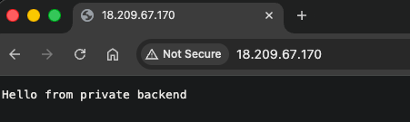

# Learn Reverse Proxies

This project exists to teach **what a reverse proxy does** and **why** people put one in front of an application—using a deliberately small setup you can deploy and poke at.

You are not here to memorize Terraform. You _are_ here to see: one machine faces the internet, another machine runs the app in private, and **NGINX** is the single front door that forwards browser and API traffic to the backend.

---

## What a reverse proxy is (here)

A **reverse proxy** sits **in front of** your app. Clients talk to the proxy; the proxy opens a second connection to your app and passes the request through.

In this repo, **NGINX** listens on port **80** on a **public** server. Your app runs on another server in a **private** subnet and listens on **3000**. From the outside, users only ever hit the proxy URL. They do not connect to the backend’s IP directly—by design.

```text
Internet  →  NGINX (public EC2 :80)  →  Node app (private EC2 :3000)
```

That pattern shows up everywhere: hiding internal hosts, having one TLS termination point, routing paths to different services, rate limits, auth at the edge, etc. This demo keeps it to one path: **HTTP in, proxy_pass to the private app.**

---

## What you should understand after you run it

1. **The proxy is the only public entry** — Your browser uses the proxy’s **public IP** (and port 80). That matches how many systems expose apps without giving every server a public address.

2. **The backend is intentionally not internet-facing** — It has **no** public IP. So “reach my app” means “go through NGINX,” not “connect straight to port 3000 on the internet.”

3. **Security groups mirror the story** — The backend allows port **3000** only from the **proxy’s** security group, not from `0.0.0.0/0`. That enforces the same rule as the architecture: only the proxy may talk to the app on that port.

4. **`proxy_pass` is the core NGINX idea** — Config on the proxy forwards `/` to `http://<private-backend-ip>:3000`. Headers like `Host` and `X-Real-IP` are the usual knobs so the backend knows something about the original client.

Optional: SSH into the **proxy** host and inspect `/etc/nginx/conf.d/backend_proxy.conf` to connect the tutorial to real files.

---

## Project layout

```text
AWS_Proxy/
├── PROJECT.md                 # Architecture checklist & optional extras
├── README.md                  # This guide
├── assets/                    # Images for this guide (optional)
└── terraform/
    ├── *.tf                   # VPC, NAT, security groups, EC2, outputs
    ├── terraform.tfvars.example
    └── templates/             # First-boot scripts for the instances
        ├── backend_user_data.sh
        └── proxy_user_data.sh.tftpl
```

## What Terraform builds

- **VPC** (`10.0.0.0/16`) with DNS
- **Public subnet** (`10.0.1.0/24`) — NGINX proxy
- **Private subnet** (`10.0.2.0/24`) — Node backend
- **Internet gateway** — public subnet reaches the internet
- **NAT gateway + Elastic IP** — private subnet can reach the internet (packages on boot)
- **Route tables** — public via IGW, private via NAT
- **Two security groups** — proxy: HTTP (80) + SSH (22); backend: port **3000** only from the proxy
- **Two EC2 instances** — proxy (public IP) + backend (no public IP)

---

## Run it on AWS (Terraform)

Infrastructure code lives in `terraform/` and follows [PROJECT.md](PROJECT.md). The AWS provider uses your **default credential chain** (`aws configure`, `AWS_PROFILE`, env vars, or an IAM role)—nothing is stored in the repo.

**Requirements:** Terraform `>= 1.5`, AWS account access. **SSH is optional:** set `key_name` in `terraform.tfvars` only if you created an EC2 **key pair** with that exact name in the **same region** as the stack (otherwise you get `InvalidKeyPair.NotFound`). Omit `key_name` to deploy without a key—you can still test HTTP with `curl`.

```bash
aws sts get-caller-identity   # confirm credentials

cp terraform/terraform.tfvars.example terraform/terraform.tfvars
# Edit terraform.tfvars: optional key_name, aws_region, ssh_cidr

cd terraform
terraform init
terraform apply
```

Wait **2–3 minutes** after instances boot (packages and services install), then:

```bash
curl "http://$(terraform output -raw proxy_public_ip)"
```

You should see: `Hello from private backend`.

In a browser, use the same address as `curl`: **`http://`** plus the IP from `terraform output -raw proxy_public_ip` (this stack only serves **HTTP** on port 80, so the bar may show “Not secure,” which is normal for plain HTTP).



Use **`terraform output -raw proxy_public_ip`** each time—the IP can change if Terraform replaces the proxy instance.

**If port 80 is “connection refused”:** Wait 2–3 minutes for cloud-init; curl **`terraform output -raw proxy_public_ip`**. Then **`terraform apply`** so the **proxy instance is recreated** with the latest bootstrap (cloud-init runs only on first boot). Typical causes we guard against in code: picking an **ECS-optimized AMI** instead of general-purpose AL2023; NGINX **`default_server`** clashes; SELinux blocking upstream (`httpd_can_network_connect`). **Terraform `templatefile` caveat:** nginx variables must appear as **`$host`**, **`$scheme`**, etc.—writing **`$$host`** does **not** escape to **`$`** in Terraform; it can produce an invalid config so **`nginx -t`** fails and nothing listens on port 80.

**Sanity-check the lesson:** That response is produced by the **private** Node process, but you never addressed it by a public IP—you went through **NGINX**.

When you are done experimenting:

```bash
terraform destroy
```

This stack uses a **NAT Gateway** so the private instance can bootstrap; it has ongoing cost until you destroy it. See [AWS NAT Gateway pricing](https://aws.amazon.com/vpc/pricing/).

---

More detail: [PROJECT.md](PROJECT.md) (NGINX snippet, validation, HTTPS / auth ideas).
